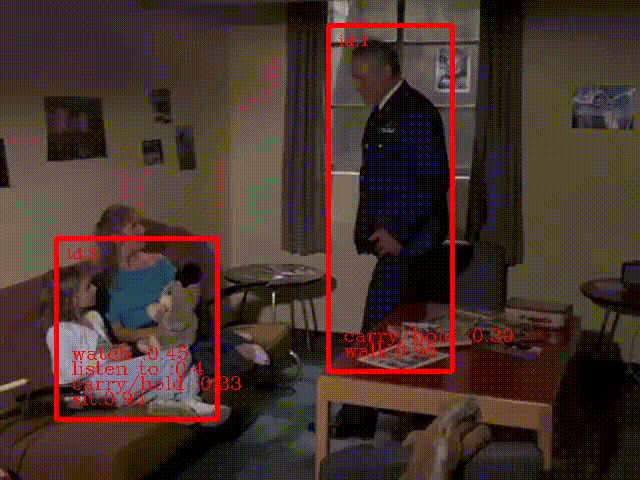

# SlowFast-Network-pytorch
An easy PyTorch implement of SlowFast-Network ["SlowFast Networks for Video Recognition"](https://arxiv.org/abs/1812.03982).

We also complete a real-time action detection demo. The demo is orgnized as：

```bash
         Yolo v3  
            │    
            │
         deepsort  
            │      
            │ 
     SlowFast Network
 ```
## Display the demo results





## Run the demo on your own data
1.Clone the repository
```bash
git clone https://github.com/MagicChuyi/SlowFast-Network-pytorch.git
```
2.Download Yolo v3 model: 
https://pan.baidu.com/s/1tT2uzI44KD3zzAgMskU1Aw

3.Download DeepSort re-id model: 
https://pan.baidu.com/s/1D1_Lw_lq-O75xFX-zFEEbg

4.Download Pre-trained SlowFast Network model: 
https://pan.baidu.com/s/17GLB2k3VhPgRsVCadVmjaA

5.Modify the model path and your video path in video_demo.py.

6.Run video_demo.py.
## Train your own model
1.Download AVA dataset.

2.Discard corrupted data.

3.Dataset should be orgnized as：  
```
ava/ava
│    │ preproc_train  
│    │    │ clips
│    │    │ keyframes
│    │    │ ava_train_v2.2.csv
│    │ preproc_val  
     │    │ clips 
     │    │ keyframes 
     │    │ ...   
```
4.Modify the params in config.py and train_config.py. 

5.Run train_video.py.


## Requirements
python 3  
PyTorch >= 1.0  
tensorboardX  
OpenCV  
## Code Reference:
[1] https://github.com/Guocode/SlowFast-Networks/  
[2] https://github.com/potterhsu/easy-faster-rcnn.pytorch 

